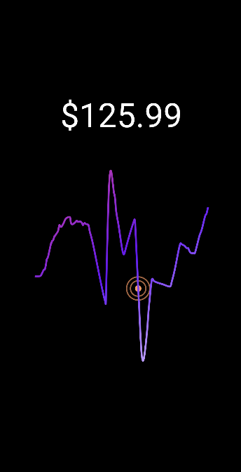

# rn-cute-stocks

A performant, interactive stock chart component for React Native. Built with Skia and Reanimated for smooth animations and D3 for precise calculations.



## Features

- **Smooth**: Uses Skia and Reanimated to offload animations to the UI thread
- **Gesture-driven**: Move across the chart to see real-time price updates
- **Customizable**: Bring your own cursor component or use the default. Use colors as you like
- **Multiple curve types**: Linear, Basis, Monotone, Natural, and Bump curves
- **Lightweight**: Minimal bundle size—just the essentials
- **TypeScript-friendly**: Well-typed API (coming soon)

## Installation

First, install the peer dependencies:

```bash
npm install @shopify/react-native-skia react-native-reanimated react-native-gesture-handler d3-array d3-scale d3-shape
```

Then install the library:

```bash
npm install rn-cute-stocks
```

## Compatibility

- React Native >= 0.79.0
- React >= 19.0.0
- iOS & Android

## Quick Start

```jsx
import { StockCharts } from 'rn-cute-stocks';

const chartData = [
  { timestamp: 1704067200000, price: 150.5 },
  { timestamp: 1704153600000, price: 152.3 },
  { timestamp: 1704240000000, price: 148.7 },
  // ... more data points
];

export default function App() {
  return (
    <StockCharts
      width={350}
      height={300}
      chartData={chartData}
      colors={['#3b82f6', '#8b5cf6']}
      curveType="curveBasis"
      curveStrokeWidth={3}
    />
  );
}
```

## API Reference

### StockCharts Props

| Prop | Type | Default | Description |
|------|------|---------|-------------|
| `width` | `number` | **required** | Chart canvas width |
| `height` | `number` | **required** | Chart canvas height |
| `chartData` | `Array<{timestamp: number, price: number}>` | **required** | Array of data points with Unix timestamps and prices |
| `colors` | `string[]` | `['#000']` | Gradient colors for the chart line |
| `curveType` | `string` | `'curveBasis'` | Curve interpolation type (see below) |
| `curveStrokeWidth` | `number` | `2` | Width of the chart line |
| `curveFill` | `'stroke' \| 'fill'` | `'stroke'` | Whether to fill or stroke the path |
| `priceTextStyles` | `TextStyle` | `{}` | Custom styles for the price text display |
| `chartContainerStyles` | `ViewStyle` | `{}` | Custom styles for the chart container |
| `cursorComponent` | `(props: {xPos: SharedValue, yPos: SharedValue}) => JSX.Element` | default cursor | Custom cursor component |
| `ySearch` | `string` | `'binarySearchWithInterpolation'` | Algorithm to find Y-vals corresponding to X-vals |

### Curve Types

- `curveBasis` - Smooth bezier curve (default)
- `curveBumpX` - Bump curve optimized for time-series data
- `curveLinear` - Straight lines between points
- `curveMonotoneX` - Monotone cubic interpolation
- `natural` - Natural cubic spline

## Advanced Usage

### Custom Cursor

Want your own cursor? Pass a component that accepts `xPos` and `yPos` shared values:

```jsx
import { Circle } from '@shopify/react-native-skia';

const CustomCursor = ({ xPos, yPos }) => (
  <Circle cx={xPos} cy={yPos} r={8} color="#ff6b6b" />
);

<StockCharts
  {...props}
  cursorComponent={CustomCursor}
/>
```

### Styling

```jsx
<StockCharts
  {...props}
  priceTextStyles={{
    fontSize: 42,
    fontWeight: 'bold',
    color: '#1a1a1a',
  }}
  colors={['#ff6b6b', '#4ecdc4', '#45b7d1']}
  curveStrokeWidth={4}
/>
```

## Data Format

Your data should be an array of objects with `timestamp` (Unix timestamp in milliseconds) and `price` (number):

```javascript
const chartData = [
  { timestamp: 1704067200000, price: 150.5 },
  { timestamp: 1704153600000, price: 152.3 },
  { timestamp: 1704240000000, price: 148.7 },
];
```

The library handles the rest—scaling, interpolation, and touch interactions.

## ⚠️ Please Note

- Wrap your app inside `GestureHandlerRootView` from react-native-gesture-handler (typically in your root layout.tsx file)
- Keep data arrays above 50 points for smooth curves
- The library caches path calculations, so re-renders are cheap
- Only one parameter for ySearch algorithm is implemented for now, which is `binarySearchWithInterpolation`. And this search for Y-values corresponding to X-values runs on the JS thread with runOnJS() function.

## To Do

- [ ] TypeScript definitions
- [ ] Add support real time data visualisation
- [ ] Volume chart support
- [ ] Multiple chart overlays
- [ ] More gesture controls (pinch to zoom, etc.)
- [ ] Custom Y-axis labels
- [ ] More chart types

## Contributing

Found a bug or have a feature request? Open an issue on [GitHub](https://github.com/DivyanshuShekhar55/rn-cute-stocks/issues).

Pull requests are welcome! Just make sure your code follows the existing style.

## License

MIT © [Divyanshu Shekhar](https://github.com/DivyanshuShekhar55)
