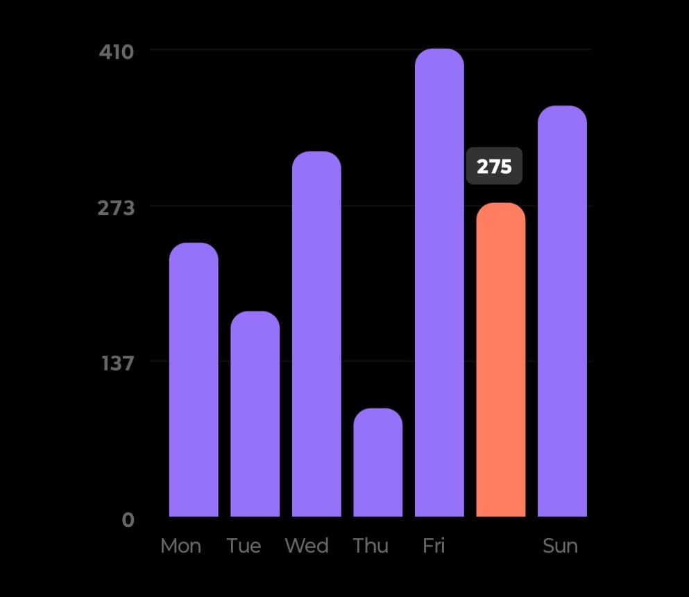
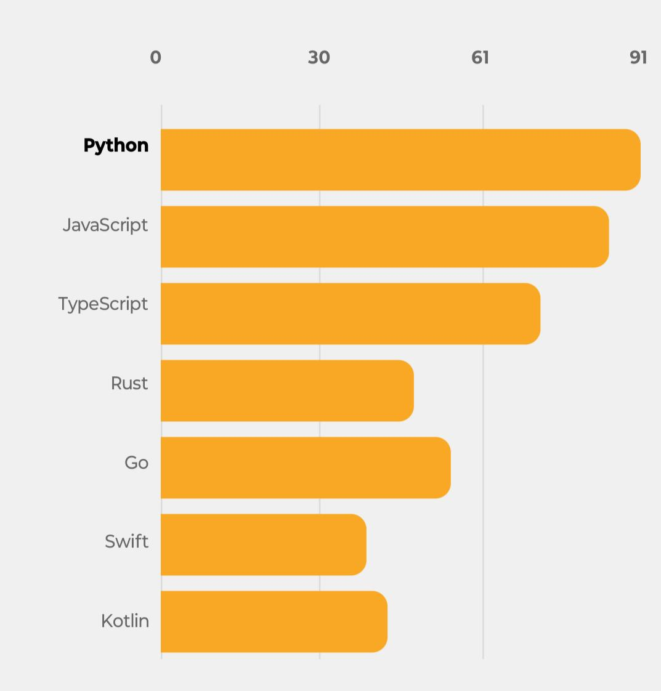
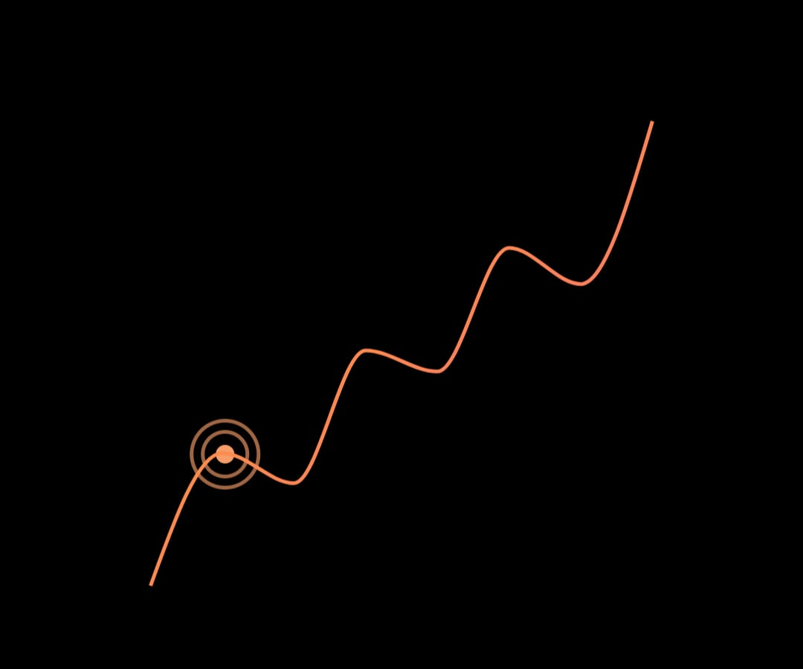
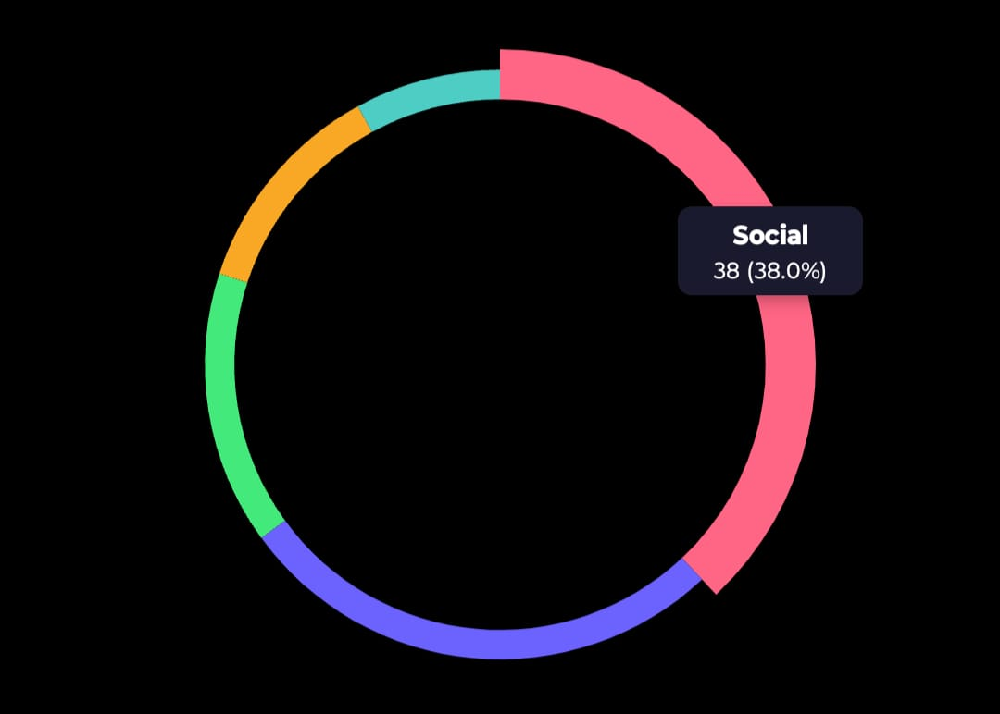
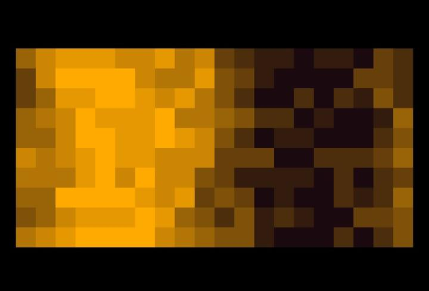
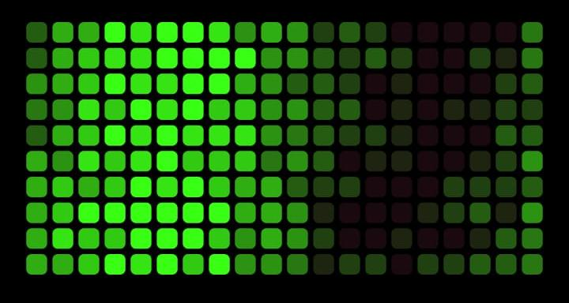
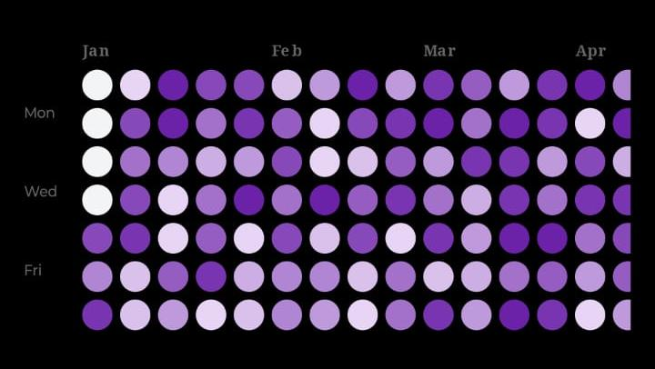
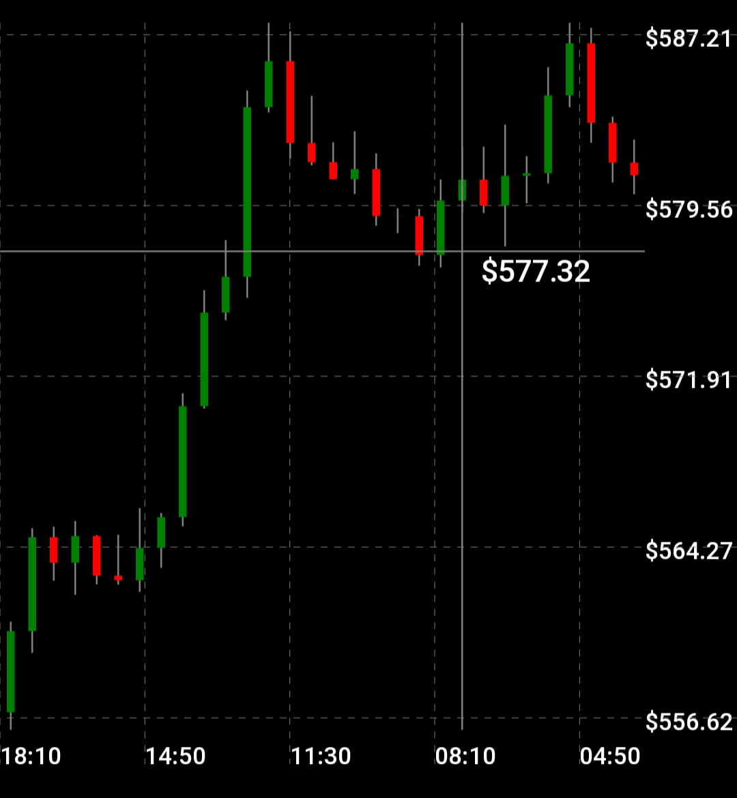
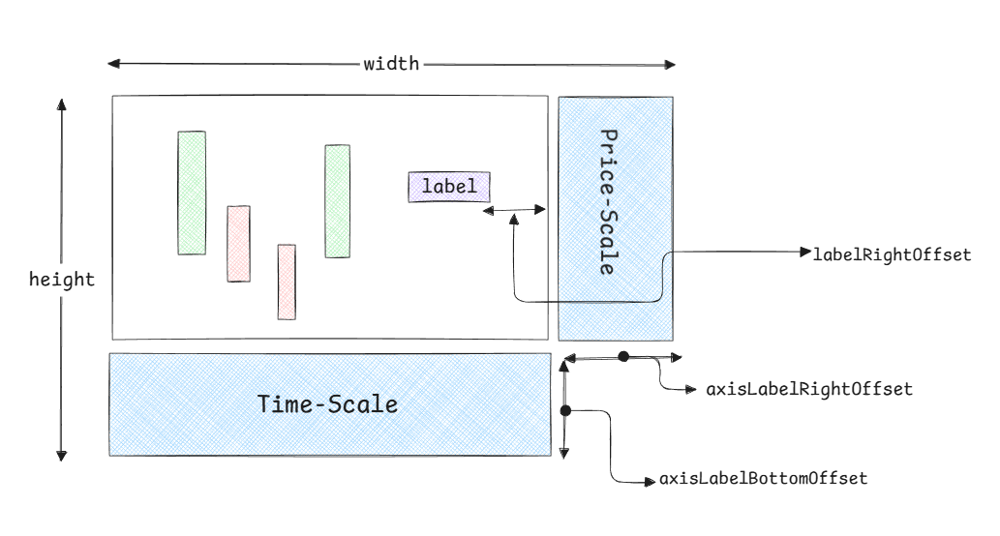

# rn-cute-charts

[](https://www.npmjs.com/package/rn-cute-charts)
[](https://www.npmjs.com/package/rn-cute-charts)
[](https://www.npmjs.com/package/rn-cute-charts)

A high-performance, delightful charting library for React Native built on Skia and Reanimated.

## Charts Available

- **[Vertical Bar Chart](#vertical-bar-chart)**: Tap-interactive vertical bar charts with optional horizontal scroll
- **[Horizontal Bar Chart](#horizontal-bar-chart)**: Tap-interactive horizontal bar charts with optional vertical scroll
- **[Line Chart](#line-chart)**: Smooth, gesture-driven line charts for generic labeled data
- **[Time Series Chart](#time-series-chart)**: Gesture-driven line charts for timestamp-based financial/time data
- **[Pie + Donut Chart](#pie-chart)**: Tap-interactive pie charts with animated slice highlight
- **[HeatMap](#heat-map)**: Interactive heatmaps for dense and sparse type data with optional scrolling and cell selection
- **[CalendarHeatMap](#calendar-heatmap)**: GitHub-style contribution heatmaps for date-based activity with cell selection
- **[Candlestick Chart](#candlestick-chart)**: Interactive OHLC candlestick charts with pinch zoom and pan

## Installation

Install peer dependencies first.
These are the dependencies you will have by default probably in any app with "cool" animations. Namely : skia, reanimated, gesture-handler and worklets.

```bash
npm install @shopify/react-native-skia react-native-reanimated react-native-gesture-handler react-native-worklets
```

You also need a d3.js dependency :

```bash
npm install d3-shape
```

Then install the library:

```bash
npm install rn-cute-charts
```

## Compatibility

- React Native >= 0.83.0
- React >= 19.0.0
- iOS & Android

## Important Notes

- Wrap your app in `GestureHandlerRootView` from `react-native-gesture-handler` (typically in your root layout file)

## A note on bad data

We do our best to handle messy data gracefully instead of crashing:

- Bars with invalid/missing values render at **0 width/height** instead of breaking layout.
- Line and Time Series charts **break the path** at gaps caused by bad points, rather than drawing through them.
- The value label on Line/Time Series charts shows **`"-"`** when the cursor lands on a bad/unresolvable point, instead of showing a stale or wrong number.

That said — this is best-effort, not a substitute for clean input. We handle the math and rendering; **you're still responsible for the quality of the data you pass in.** Malformed timestamps, `NaN`/`null` values, or unsorted data can still produce a chart that's technically non-crashing but visually odd (frozen cursors, sudden gaps, zero-size bars). If something looks wrong, check your data first.

---

## Vertical Bar Chart

### Features

- Tap a bar to highlight it and show its value in a floating bubble
- Spring, linear, or no tap animation — fully configurable
- Optional horizontal scroll when bars don't fit the given width
- All UI rendered with Skia
- Scroll sync between bars and X-axis labels runs on the UI thread (zero lag)

<p align="center">
  
</p>

### Quick Start

```tsx
import { VerticalBarChart } from "rn-cute-charts";
import type { BarDataItem } from "rn-cute-charts";

const data: BarDataItem[] = [
  { x: "Mon", y: 120 },
  { x: "Tue", y: 180 },
  { x: "Wed", y: 134 },
];

export default function App() {
  return (
    <VerticalBarChart
      width={320}
      height={320}
      data={data}
      color="#9672f8"
      activeColor="#ff7e5f"
    />
  );
}
```

### API Reference

| Prop                   | Type              | Default      | Description                                                           |
| ---------------------- | ----------------- | ------------ | --------------------------------------------------------------------- |
| `width`                | `number`          | **required** | Chart width                                                           |
| `height`               | `number`          | **required** | Chart height                                                          |
| `data`                 | `BarDataItem[]`   | **required** | Array of `{ x: string, y: number }`                                   |
| `color`                | `string`          | `"#9672f8"`  | Default bar color                                                     |
| `activeColor`          | `string`          | `"#ff7e5f"`  | Color of the tapped/active bar                                        |
| `barGap`               | `number`          | `0.2`        | Padding ratio between bars (0–1)                                      |
| `bend`                 | `number`          | `10`         | Top corner radius of bars                                             |
| `numYLabels`           | `number`          | `3`          | Number of Y-axis tick labels                                          |
| `fontSize`             | `number`          | `12`         | Font size for axis labels and the value badge                         |
| `labelFontColor`       | `string`          | `#f0f0f0`    | Label text colour                                                     |
| `labelActiveFontColor` | `string`          | `#fff`       | Label text colour when active/selected                                |
| `badgeBackgroundColor` | `string`          | `"#333"`     | Background colour of the active bar's value badge                     |
| `badgeFontColor`       | `string`          | `"#fff"`     | Text colour of the active bar's value badge                           |
| `scrollable`           | `boolean`         | `false`      | Enable horizontal scroll when bars are too many to fit                |
| `minBarWidth`          | `number`          | `25`         | Minimum bar width in px when scrollable                               |
| `xLabelHeight`         | `number`          | `0.1`        | Fraction of `height` reserved for the x-axis category label strip     |
| `yLabelWidth`          | `number`          | `0.20`       | Fraction of `width` reserved for the y-axis numeric label strip       |
| `animationType`        | `AnimationType`   | `"spring"`   | Tap animation: `"spring"`, `"linear"`, or `"none"`                    |
| `animationConfig`      | `AnimationConfig` | see below    | Config for the animation driver                                       |
| `jsThrottleMs`         | `number`          | `100`        | Throttle (ms) for JS-thread updates during scroll. See warning below. |

> ⚠️ **`jsThrottleMs` warning:** lowering this too far increases how often React state updates fire during scroll/pan. Too low a value (e.g. under ~30–40ms) can flood the JS thread and crash or freeze the app on lower-end devices. Raise it, don't lower it, if you run into performance issues.

---

## Horizontal Bar Chart

### Features

- Same feature set as Vertical Bar Chart, rotated 90°
- Bars grow rightward from the Y-axis
- Optional vertical scroll with sticky top numeric axis
- Scroll sync between bars and category labels runs on UI thread

<p align="center">
  
</p>

### Quick Start

```tsx
import { HorizontalBarChart } from "rn-cute-charts";
import type { BarDataItem } from "rn-cute-charts";

const data: BarDataItem[] = [
  { x: "Sales", y: 40 },
  { x: "Support", y: 25 },
  { x: "Marketing", y: 20 },
];

export default function App() {
  return (
    <HorizontalBarChart
      width={320}
      height={320}
      data={data}
      color="#9672f8"
      activeColor="#ff7e5f"
    />
  );
}
```

### API Reference

| Prop                   | Type              | Default      | Description                                                           |
| ---------------------- | ----------------- | ------------ | --------------------------------------------------------------------- |
| `width`                | `number`          | **required** | Chart width                                                           |
| `height`               | `number`          | **required** | Chart height                                                          |
| `data`                 | `BarDataItem[]`   | **required** | Array of `{ x: string, y: number }`                                   |
| `color`                | `string`          | `"#9672f8"`  | Default bar color                                                     |
| `activeColor`          | `string`          | `"#ff7e5f"`  | Color of the tapped/active bar                                        |
| `barGap`               | `number`          | `0.2`        | Padding ratio between bars (0–1)                                      |
| `bend`                 | `number`          | `10`         | Right corner radius of bars                                           |
| `numXLabels`           | `number`          | `3`          | Number of X-axis (numeric) tick labels                                |
| `fontSize`             | `number`          | `12`         | Font size for axis labels and the value badge                         |
| `labelFontColor`       | `string`          | `#f0f0f0`    | Label text colour                                                     |
| `labelActiveFontColor` | `string`          | `#fff`       | Label text colour when active/selected                                |
| `badgeBackgroundColor` | `string`          | `"#333"`     | Background colour of the active bar's value badge                     |
| `badgeFontColor`       | `string`          | `"#fff"`     | Text colour of the active bar's value badge                           |
| `scrollable`           | `boolean`         | `false`      | Enable vertical scroll when bars are too many to fit                  |
| `minBarHeight`         | `number`          | `25`         | Minimum bar height in px when scrollable                              |
| `xAxisHeight`          | `number`          | `0.1`        | Fraction of `height` reserved for the x-axis numeric tick label strip |
| `yAxisWidth`           | `number`          | `0.20`       | Fraction of `width` reserved for the y-axis category label strip      |
| `animationType`        | `AnimationType`   | `"spring"`   | Tap animation: `"spring"`, `"linear"`, or `"none"`                    |
| `animationConfig`      | `AnimationConfig` | see below    | Config for the animation driver                                       |
| `jsThrottleMs`         | `number`          | `100`        | Throttle (ms) for JS-thread updates during scroll. See warning below. |

> ⚠️ **`jsThrottleMs` warning:** lowering this too far increases how often React state updates fire during scroll/pan. Too low a value (e.g. under ~30–40ms) can flood the JS thread and crash or freeze the app on lower-end devices. Raise it, don't lower it, if you run into performance issues.

---

## Animation Config

Both bar charts accept an `animationConfig` prop. The shape depends on `animationType`

```ts
// animationType="spring"
animationConfig={{ mass: 1, damping: 5, stiffness: 150 }}

// animationType="linear"
animationConfig={{ duration: 300 }}
```

---

## Line Chart

- For generic string-labeled data — categories and custom labels. Uses `scalePoint` internally so all points are evenly spaced.
- Supports gradient colours for the curve
- Supports multiple types of curve

<p align="center">
  
</p>

### Quick Start

```tsx
import { LineChart } from "rn-cute-charts";
import type { LineDataPoint } from "rn-cute-charts";

const data: LineDataPoint[] = [
  { x: "Week 1", y: 120 },
  { x: "Week 2", y: 145 },
  { x: "Week 3", y: 132 },
];

export default function App() {
  return (
    <LineChart
      width={350}
      height={300}
      chartData={data}
      colors={["#9672f8", "#ff7e5f"]}
      curveType="curveBasis"
      valuePrefix="$"
    />
  );
}
```

### API Reference

| Prop                   | Type                                   | Default        | Description                                      |
| ---------------------- | -------------------------------------- | -------------- | ------------------------------------------------ |
| `width`                | `number`                               | **required**   | Chart canvas width                               |
| `height`               | `number`                               | **required**   | Chart canvas height                              |
| `chartData`            | `LineDataPoint[]`                      | **required**   | Array of `{ x: string, y: number }`              |
| `colors`               | `string[]`                             | `["#000"]`     | Gradient colors for the chart line               |
| `curveType`            | `CurveType`                            | `"curveBasis"` | Curve interpolation type (see below)             |
| `curveStrokeWidth`     | `number`                               | `2`            | Line stroke width                                |
| `curveFill`            | `"stroke" \| "fill"`                   | `"stroke"`     | Fill or stroke the path                          |
| `valuePrefix`          | `string`                               | `""`           | Prefix for the displayed value e.g. `"$"`, `"€"` |
| `valueTextStyles`      | `TextStyle`                            | `{}`           | Styles for the value label above the chart       |
| `chartContainerStyles` | `ViewStyle`                            | `{}`           | Styles for the outer container                   |
| `cursorComponent`      | `(props: CursorProps) => ReactElement` | default cursor | Custom cursor component                          |

> If the cursor lands on a point that can't be resolved (bad/missing data), the value label shows **`"-"`** instead of a stale or incorrect number, and the cursor itself stops updating until it's back over valid data.

---

## Time Series Chart

For timestamp-based data (stock prices, sensor data). Uses `scaleTime` internally so points are spaced proportionally by time distance.

### Quick Start

```tsx
import { TimeSeriesChart } from "rn-cute-charts";
import type { TimeSeriesDataPoint } from "rn-cute-charts";

const data: TimeSeriesDataPoint[] = [
  { x: 1704067200000, y: 150.5 },
  { x: 1704153600000, y: 152.3 },
  { x: 1704240000000, y: 148.7 },
];

export default function App() {
  return (
    <TimeSeriesChart
      width={350}
      height={300}
      chartData={data}
      colors={["#3b82f6", "#8b5cf6"]}
      curveType="curveBumpX"
    />
  );
}
```

### API Reference

| Prop                   | Type                                   | Default                           | Description                                              |
| ---------------------- | -------------------------------------- | --------------------------------- | -------------------------------------------------------- |
| `width`                | `number`                               | **required**                      | Chart canvas width                                       |
| `height`               | `number`                               | **required**                      | Chart canvas height                                      |
| `chartData`            | `TimeSeriesDataPoint[]`                | **required**                      | Array of `{ x: number, y: number }` where `x` is Unix ms |
| `colors`               | `string[]`                             | `["#000"]`                        | Gradient colors for the chart line                       |
| `curveType`            | `CurveType`                            | `"curveBasis"`                    | Curve interpolation type                                 |
| `curveStrokeWidth`     | `number`                               | `2`                               | Line stroke width                                        |
| `curveFill`            | `"stroke" \| "fill"`                   | `"stroke"`                        | Fill or stroke the path                                  |
| `textStyles`           | `TextStyle`                            | `{}`                              | Styles for the label above the chart                     |
| `chartContainerStyles` | `ViewStyle`                            | `{}`                              | Styles for the outer container                           |
| `cursorComponent`      | `(props: CursorProps) => ReactElement` | default cursor                    | Custom cursor component                                  |
| `ySearch`              | `SearchAlgorithm`                      | `"binarySearchWithInterpolation"` | Algorithm for Y lookup on pan                            |
| `valuePrefix`          | `string`                               | `""`                              | Any Prefix to attach to numeric value text               |

> Same bad-data behaviour as Line Chart: the label shows **`"-"`** and the cursor freezes on unresolvable points, rather than guessing or showing wrong data.

### Line vs Time Series — which to use?

|               | `LineChart`                  | `TimeSeriesChart`             |
| ------------- | ---------------------------- | ----------------------------- |
| X-axis data   | Any string label             | Unix timestamp (ms)           |
| Point spacing | Always equal                 | Proportional to time gap      |
| Use case      | categories and custom labels | Stock prices, sensor readings |
| X lookup      | O(1) direct index            | Binary search + interpolation |

### Curve Types (both line charts)

| Value              | Description                      |
| ------------------ | -------------------------------- |
| `"curveBasis"`     | Smooth bezier (default)          |
| `"curveBumpX"`     | Bump curve, good for time-series |
| `"curveLinear"`    | Straight lines between points    |
| `"curveMonotoneX"` | Monotone cubic interpolation     |
| `"natural"`        | Natural cubic spline             |

### Custom Cursor

Both line charts accept a `cursorComponent` prop:

```tsx
import { Circle } from "@shopify/react-native-skia";
import type { CursorProps } from "rn-cute-charts";

const CustomCursor = ({ xPos, yPos }: CursorProps) => (
  <Circle cx={xPos} cy={yPos} r={8} color="#ff6b6b" />
);

<LineChart {...props} cursorComponent={CustomCursor} />;
```

---

## Pie Chart

### Features

- Tap a slice to highlight it (pops out slightly) and show a label bubble with value and percentage
- Donut mode via `donut` + `innerRadiusRatio` props

<p align="center">
  
</p>

### Quick Start

```tsx
import { PieChart } from "rn-cute-charts";
import type { PieDataPoint } from "rn-cute-charts";

const data: PieDataPoint[] = [
  { label: "Sales", value: 40, color: "#FF6B6B" },
  { label: "Support", value: 25, color: "#4ECDC4" },
  { label: "Marketing", value: 20, color: "#45B7D1" },
  { label: "Ops", value: 15, color: "#FFA07A" },
];

export default function App() {
  return <PieChart width={300} height={300} data={data} />;
}
```

### API Reference

| Prop               | Type             | Default      | Description                                                       |
| ------------------ | ---------------- | ------------ | ----------------------------------------------------------------- |
| `width`            | `number`         | **required** | Chart width                                                       |
| `height`           | `number`         | **required** | Chart height                                                      |
| `data`             | `PieDataPoint[]` | **required** | Array of `{ label, value, color }`                                |
| `donut`            | `boolean`        | `false`      | Render as a donut chart                                           |
| `innerRadiusRatio` | `number`         | `0.6`        | Inner hole size as ratio of outer radius (only when `donut=true`) |
| `labelBgColor`     | `string`         | `"#333"`     | Background color of the tap label bubble                          |
| `labelFontColor`   | `string`         | `"#fff"`     | Text color of the tap label bubble                                |
| `activeSlicePop`   | `number`         | `1.07`       | Factor by which outer radius 'pops' outs when selected            |

---

## Heat Map

### Features

- Renders both **dense** (fill-in-order) and **sparse** (`{r, c, value}`) data — auto-detected from your data shape
- Optional horizontal scroll with column virtualisation, for grids too wide to fit on screen (e.g. calendar-style heatmaps)
- Tap a cell to get its value, index, and grid position back
- Cell colours interpolate between two configurable endpoints across N discrete steps

<p align="center">
  
  
</p>

### A note on labels

`HeatMap` deliberately renders **only cells** — no axis labels, no legend, nothing else. This isn't a missing feature, it's intentional: different heatmaps need wildly different labelling schemes (a label every Nth column, repeating weekday labels, a label only where a new month starts, no labels at all), and there's no single default that fits all of them. Rather than guess, `HeatMap` exposes an `overlayContent` prop — a function that receives the exact layout numbers (`cellWidth`, `colGap`, `totalCols`, etc.) it used to place its own cells, so you can draw whatever labels make sense for your data, and they'll scroll in perfect sync with the grid since they render inside the same transformed group as the cells. See `CalendarHeatmap` below for a real example (month labels drawn via `overlayContent`, weekday labels drawn as plain fixed text alongside it).

### Quick Start

```tsx
import { HeatMap } from "rn-cute-charts";
import type { DenseHeatMapDataPoint } from "rn-cute-charts";

const data: DenseHeatMapDataPoint[] = [
  { value: 0 },
  { value: 12 },
  { value: 4 },
  { value: 1 },
  { value: 7 },
];

export default function App() {
  return (
    <HeatMap
      width={300}
      height={300}
      data={data}
      rows={5}
      onPress={(item, index, row, col) => console.log(item, row, col)}
    />
  );
}
```

Sparse data — only specify the cells you have values for, everything else renders as `emptyColor`:

```tsx
import type { SparseHeatMapDataPoint } from "rn-cute-charts";

const data: SparseHeatMapDataPoint[] = [
  { r: 0, c: 0, value: 4 },
  { r: 2, c: 5, value: 12 },
  { r: 1, c: 9, value: 1 },
];

<HeatMap
  width={300}
  height={150}
  data={data}
  rows={3}
  columns={10}
  onPress={() => {}}
/>;
```

Scrollable, with your own overlay labels:

```tsx
import { Text as SkiaText } from "@shopify/react-native-skia";

<HeatMap
  width={300}
  height={200}
  data={data}
  rows={5}
  scrollable
  cellWidth={20}
  xLabelHeight={0.15}
  overlayContent={({ cellWidth, colGap, totalCols }) =>
    Array.from({ length: totalCols }, (_, col) => (
      <SkiaText
        key={col}
        x={colGap + col * (cellWidth + colGap)}
        y={10}
        text={`Week ${col + 1}`}
        font={myFont}
        color="#666"
      />
    ))
  }
  onPress={() => {}}
/>;
```

### API Reference

| Prop              | Type                                                  | Default         | Description                                                                                                                |
| ----------------- | ----------------------------------------------------- | --------------- | -------------------------------------------------------------------------------------------------------------------------- |
| `width`           | `number`                                              | **required**    | Chart width                                                                                                                |
| `height`          | `number`                                              | **required**    | Chart height                                                                                                               |
| `data`            | `DenseHeatMapDataPoint[] \| SparseHeatMapDataPoint[]` | **required**    | Dense (`{value}`, filled in order) or sparse (`{r, c, value}`) — auto-detected                                             |
| `rows`            | `number`                                              | **required**    | Number of rows in the grid                                                                                                 |
| `onPress`         | `(item, index, row, col) => void`                     | **required**    | Called on tap. For sparse data with no entry at the tapped cell, not called at all                                         |
| `columns`         | `number`                                              | auto-derived    | Hard cap on columns. Auto-calculated from data/rows if omitted                                                             |
| `scrollable`      | `boolean`                                             | `false`         | Enable horizontal scroll when columns don't fit `width`                                                                    |
| `cellWidth`       | `number`                                              | auto-fit        | Fixed cell width. **Required when `scrollable=true`** — no auto-fit once content can overflow                              |
| `emptyColor`      | `string`                                              | `"#f3f4f6"`     | Colour for cells with no data                                                                                              |
| `initialColor`    | `string`                                              | `"#e8d5f5"`     | Colour for value = 0                                                                                                       |
| `finalColor`      | `string`                                              | `"#6b21a8"`     | Colour for the maximum value in the data                                                                                   |
| `colorSteps`      | `number`                                              | `4`             | Number of discrete colour steps between `initialColor` and `finalColor`                                                    |
| `backgroundColor` | `string`                                              | `"transparent"` | Canvas background colour                                                                                                   |
| `rowGap`          | `number`                                              | `4`             | Gap in px between rows                                                                                                     |
| `colGap`          | `number`                                              | `4`             | Gap in px between columns                                                                                                  |
| `roundedness`     | `number`                                              | `4`             | Cell corner radius                                                                                                         |
| `xLabelHeight`    | `number`                                              | `0`             | Fraction of `height` reserved at the top for `overlayContent` (e.g. `0.1` = top 10%)                                       |
| `overlayContent`  | `(layout) => ReactNode`                               | —               | Draw extra Skia content (e.g. labels) that scrolls in sync with the grid — see above                                       |
| `validateCell`    | `(row: number, col: number) => boolean`                                    | —                 | Return `false` to skip rendering a cell entirely (not even as `emptyColor`) — e.g. partial weeks at a calendar's year boundary |
| `bufferedCols`    | `number`                                              | `4`             | Extra columns rendered on each side of the visible window, avoids pop-in while scrolling                                   |
| `jsThrottleMs`    | `number`                                              | `100`           | Throttle (ms) for JS-thread scroll-position sync. Raise if you see JS FPS drops during fast scrolling on lower-end devices |

> ⚠️ **`jsThrottleMs` warning:** lowering this too far increases how often React state updates fire during scroll/pan. Too low a value (e.g. under ~30–40ms) can flood the JS thread and crash or freeze the app on lower-end devices. Raise it, don't lower it, if you run into performance issues.

---

## Calendar Heatmap

A GitHub-style contribution graph, built as a thin wrapper on top of `HeatMap` — it transforms `{date, value}` data into `HeatMap`'s sparse format, computes month/weekday label positions, and always renders scrollable (a year of days never fits one screen).

<p align="center">
  
</p>

### Quick Start

```tsx
import { CalendarHeatmap } from "rn-cute-charts";
import type { CalendarDataPoint } from "rn-cute-charts";

const data: CalendarDataPoint[] = [
  { date: new Date(2026, 0, 1), value: 3 },
  { date: new Date(2026, 0, 2), value: 0 },
  // ...
];

export default function App() {
  return (
    <CalendarHeatmap
      width={350}
      height={140}
      data={data}
      onPress={(date, value) => console.log(date, value)}
    />
  );
}
```

### API Reference

| Prop                                                                                                                  | Type                                               | Default                           | Description                                                                                                                |
| --------------------------------------------------------------------------------------------------------------------- | -------------------------------------------------- | --------------------------------- | -------------------------------------------------------------------------------------------------------------------------- |
| `width`                                                                                                               | `number`                                           | **required**                      | Chart width                                                                                                                |
| `height`                                                                                                              | `number`                                           | **required**                      | Chart height                                                                                                               |
| `data`                                                                                                                | `CalendarDataPoint[]`                              | **required**                      | Array of `{ date: Date, value: number }`                                                                                   |
| `startDate`                                                                                                           | `Date`                                             | Jan 1 of current year             | Range rendered is always exactly one year forward from this date                                                           |
| `cellWidth`                                                                                                           | `number`                                           | `12`                              | Width of each day cell in px                                                                                               |
| `onPress`                                                                                                             | `(date: Date, value: number \| undefined) => void` | —                                 | Called on tap with the real calendar `Date`, not row/col                                                                   |
| `showLabels`                                                                                                          | `boolean`                                          | `true`                            | Controls both weekday labels (Mon/Wed/Fri) and month labels                                                                |
| `labelStyle`                                                                                                          | `{ fontSize: number, color: string }`              | `{ fontSize: 10, color: "#666" }` | Font styling for both label types                                                                                          |
| `emptyColor` / `initialColor` / `finalColor` / `colorSteps` / `backgroundColor` / `rowGap` / `colGap` / `roundedness` | —                                                  | see `HeatMap`                     | Forwarded straight through to the underlying `HeatMap`                                                                     |
| `bufferedCols`                                                                                                        | `number`                                           | `4`                               | Extra columns rendered on each side of the visible window, avoids pop-in while scrolling                                   |
| `jsThrottleMs`                                                                                                        | `number`                                           | `100`                             | Throttle (ms) for JS-thread scroll-position sync. Raise if you see JS FPS drops during fast scrolling on lower-end devices |
| `dayLabels` | `number[]`  | `[1, 3, 5]` | Days to render on left of grid (0=Sunday) |

> Week starts on **Sunday**, matching GitHub's own contribution graph convention.

## Candlestick Chart

### Features

- Single finger crosshair with price label
- Two-finger pinch zoom (constrained between `minVisibleCandles` and `maxVisibleCandles`)
- Three-finger pan to scroll through history
- Auto-scaling axes (price and time)
- Dashed, solid, or no axis grid lines

<p align="center">
  
</p>

### Quick Start

```tsx
import { CandleStickChart } from "rn-cute-charts";
import type { Candle } from "rn-cute-charts";

const data: Candle[] = [
  { timestamp: 1704067200, open: 150.5, high: 152.8, low: 149.2, close: 151.3 },
  { timestamp: 1704070800, open: 151.3, high: 153.5, low: 150.8, close: 152.1 },
];

export default function App() {
  return (
    <CandleStickChart
      width={400}
      height={600}
      data={data}
      fill={["#22c55e", "#ef4444"]}
      bgCol="#0a0a0a"
    />
  );
}
```

### API Reference

| Prop                    | Type                 | Default                   | Description                                        |
| ----------------------- | -------------------- | ------------------------- | -------------------------------------------------- |
| `width`                 | `number`             | **required**              | Total chart width including axis margins           |
| `height`                | `number`             | **required**              | Total chart height including axis margins          |
| `data`                  | `Candle[]`           | **required**              | Array of OHLC candles with Unix second timestamps  |
| `bgCol`                 | `string`             | `"white"`                 | Background color                                   |
| `fill`                  | `[string, string]`   | `["green","red"]`         | Colors for bullish and bearish candles             |
| `currency`              | `string`             | `"$"`                     | Currency symbol for crosshair price label          |
| `labelFontSize`         | `number`             | `18`                      | Font size for crosshair price label                |
| `labelRightOffset`      | `number`             | `96`                      | Right offset for crosshair price label             |
| `labelFontCol`          | `string`             | `"black"`                 | Color of crosshair price label                     |
| `numLabels`             | `number`             | `5`                       | Number of labels on each axis                      |
| `axisFontColor`         | `string`             | `"black"`                 | Axis label text color                              |
| `axisFontSize`          | `number`             | `14`                      | Axis label font size                               |
| `axisLabelRightOffset`  | `number`             | `54`                      | Space reserved on right for Y-axis labels          |
| `axisLabelBottomOffset` | `number`             | `20`                      | Space reserved at bottom for X-axis labels         |
| `axisLinePathEffect`    | `AxisLinePathEffect` | `"dashed"`                | Grid line style: `"dashed"`, `"line"`, or `"none"` |
| `axisLineColor`         | `string`             | `"gray"`                  | Grid line color                                    |
| `wickColor`             | `string`             | `"rgba(255,255,255,0.6)"` | Candle wick color                                  |
| `crossHairColor`        | `string`             | `"rgba(255,255,255,0.6)"` | Crosshair line color                               |
| `maxVisibleCandles`     | `number`             | `50`                      | Zoom-out limit                                     |
| `minVisibleCandles`     | `number`             | `10`                      | Zoom-in limit                                      |

### Gesture Controls

| Fingers | Gesture | Action                                     |
| ------- | ------- | ------------------------------------------ |
| 1       | Pan     | Crosshair — snaps to nearest candle center |
| 2       | Pinch   | Zoom in/out around focal point             |
| 3       | Pan     | Scroll left/right through history          |

### Layout

<p align="center">
  
</p>

The chart automatically calculates:

- **Chart region width** = `width - axisLabelRightOffset`
- **Chart region height** = `height - axisLabelBottomOffset`

Candles and crosshair render inside the chart region. Axes occupy the margin areas.

---

## TypeScript Types

All types are exported from the root import:

```ts
import type {
  // Shared bar chart types
  BarDataItem,
  AnimationType,
  AnimationConfig,
  SpringAnimationConfig,
  LinearAnimationConfig,

  // Line / TimeSeries types
  LineDataPoint,
  TimeSeriesDataPoint,
  CurveType,
  SearchAlgorithm,
  YForXResult,
  CursorProps,

  // Pie chart types
  PieDataPoint,

  // Candlestick types
  Candle,
  Domain,
  AxisLinePathEffect,
  CandleStickChartProps,
} from "rn-cute-charts";
```

---

## To Do

- [ ] Mount entry animations for charts
- [ ] Easing config prop for linear animation
- [ ] Real-time data support for candlestick and timeseries charts
- [ ] stacked bar charts
- [ ] migrate to gesture handler v3

## Contributing

Found a bug or have a feature request? Open an issue on [GitHub](https://github.com/DivyanshuShekhar55/rn-cute-stocks/issues).

Pull requests are welcome. Follow the existing code style and make sure types are exported.

## License

MIT © [Divyanshu Shekhar](https://github.com/DivyanshuShekhar55)
