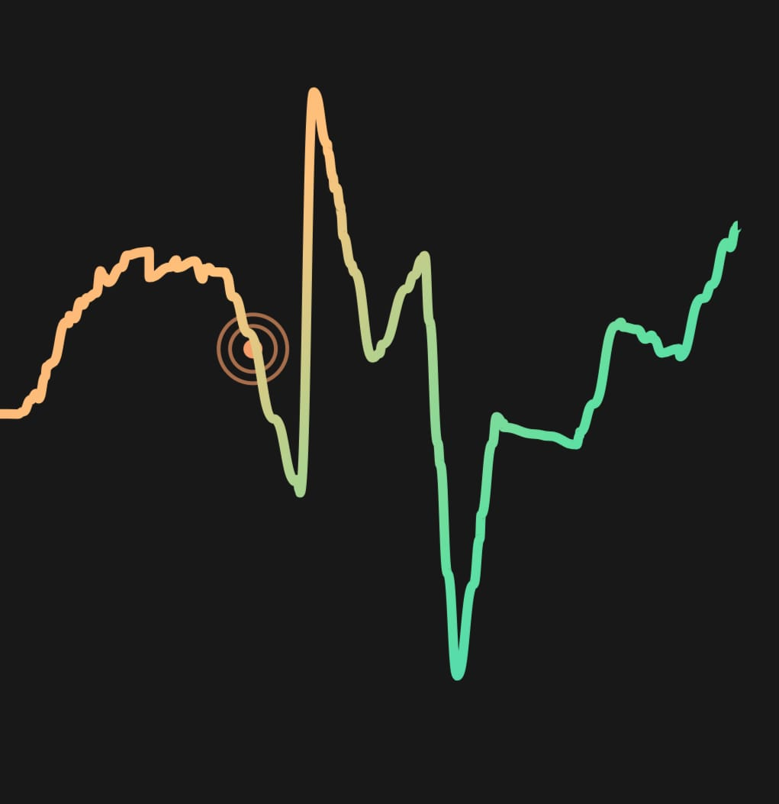

# rn-cute-stocks

A performant, interactive stock chart library for React Native. Built with Skia and Reanimated for smooth animations and D3 for precise calculations.

## Charts Available

- **Line Chart**: Smooth, gesture-driven line charts for stock price trends
- **Candlestick Chart**: Interactive OHLC (Open-High-Low-Close) candlestick charts with zoom and pan support

## Installation

First, install the peer dependencies:

```bash
npm install @shopify/react-native-skia react-native-reanimated react-native-gesture-handler react-native-worklets d3-array d3-scale d3-shape
```

Then install the library:

```bash
npm install rn-cute-stocks
```

## Compatibility

- React Native >= 0.79.0
- React >= 19.0.0
- iOS & Android

## Important Notes

- Wrap your app inside `GestureHandlerRootView` from react-native-gesture-handler (typically in your root layout file)
- The library uses `react-native-worklets` for smooth updates via `scheduleOnRN()` instead of blocking the JS thread

---

## Line Chart



### Features

- **Smooth**: Uses Skia and Reanimated to offload animations to the UI thread
- **Gesture-driven**: Move across the chart to see real-time price updates
- **Customizable**: Bring your own cursor component or use the default. Use colors as you like
- **Multiple curve types**: Linear, Basis, Monotone, Natural, and Bump curves
- **Lightweight**: Minimal bundle size—just the essentials
- **TypeScript-friendly**: Well-typed API (coming soon)

### Quick Start

```jsx
import { StockCharts } from 'rn-cute-stocks';

const chartData = [
  { timestamp: 1704067200000, price: 150.5 },
  { timestamp: 1704153600000, price: 152.3 },
  { timestamp: 1704240000000, price: 148.7 },
  // ... more data points
];

export default function App() {
  return (
    <StockCharts
      width={350}
      height={300}
      chartData={chartData}
      colors={['#3b82f6', '#8b5cf6']}
      curveType="curveBasis"
      curveStrokeWidth={3}
    />
  );
}
```

### Line Chart API Reference

#### StockCharts Props

| Prop | Type | Default | Description |
|------|------|---------|-------------|
| `width` | `number` | **required** | Chart canvas width |
| `height` | `number` | **required** | Chart canvas height |
| `chartData` | `Array<{timestamp: number, price: number}>` | **required** | Array of data points with Unix timestamps and prices |
| `colors` | `string[]` | `['#000']` | Gradient colors for the chart line |
| `curveType` | `string` | `'curveBasis'` | Curve interpolation type (see below) |
| `curveStrokeWidth` | `number` | `2` | Width of the chart line |
| `curveFill` | `'stroke' \| 'fill'` | `'stroke'` | Whether to fill or stroke the path |
| `priceTextStyles` | `TextStyle` | `{}` | Custom styles for the price text display |
| `chartContainerStyles` | `ViewStyle` | `{}` | Custom styles for the chart container |
| `cursorComponent` | `(props: {xPos: SharedValue, yPos: SharedValue}) => JSX.Element` | default cursor | Custom cursor component |
| `ySearch` | `string` | `'binarySearchWithInterpolation'` | Algorithm to find Y-vals corresponding to X-vals |

#### Curve Types

- `curveBasis` - Smooth bezier curve (default)
- `curveBumpX` - Bump curve optimized for time-series data
- `curveLinear` - Straight lines between points
- `curveMonotoneX` - Monotone cubic interpolation
- `natural` - Natural cubic spline

### Advanced Usage

#### Custom Cursor

Want your own cursor? Pass a component that accepts `xPos` and `yPos` shared values:

```jsx
import { Circle } from '@shopify/react-native-skia';

const CustomCursor = ({ xPos, yPos }) => (
  <Circle cx={xPos} cy={yPos} r={8} color="#ff6b6b" />
);

<StockCharts
  {...props}
  cursorComponent={CustomCursor}
/>
```

#### Styling

```jsx
<StockCharts
  {...props}
  priceTextStyles={{
    fontSize: 42,
    fontWeight: 'bold',
    color: '#1a1a1a',
  }}
  colors={['#ff6b6b', '#4ecdc4', '#45b7d1']}
  curveStrokeWidth={4}
/>
```

### Line Chart Data Format

Your data should be an array of objects with `timestamp` (Unix timestamp in milliseconds) and `price` (number):

```javascript
const chartData = [
  { timestamp: 1704067200000, price: 150.5 },
  { timestamp: 1704153600000, price: 152.3 },
  { timestamp: 1704240000000, price: 148.7 },
];
```

The library handles the rest—scaling, interpolation, and touch interactions.

#### Additional Notes

- Keep data arrays above 50 points for smooth curves
- The library caches path calculations, so re-renders are cheap

---

## Candlestick Chart


### Features

- **Interactive Gestures**: Single finger crosshair, two-finger zoom, three-finger pan
- **Smooth Performance**: Built with Skia for hardware-accelerated rendering
- **Auto-scaling Axes**: Dynamic price and time labels
- **Fully Customizable**: Colors, fonts, axis styling, and label offsets
- **Worklet-based Updates**: Uses react-native-worklets for smooth UI updates without JS thread blocking

### Importing

```jsx
import { CandleStickChart } from 'rn-cute-stocks/candlestick';
```

### Data Format

Each candle requires four OHLC values plus a timestamp:

```javascript
const candleData = [
  {
    timestamp: 1704067200,  // Unix timestamp in seconds
    open: 150.5,
    high: 152.8,
    low: 149.2,
    close: 151.3
  },
  {
    timestamp: 1704070800,
    open: 151.3,
    high: 153.5,
    low: 150.8,
    close: 152.1
  },
  // ... more candles
];
```

### Basic Usage

```jsx
import { CandleStickChart } from 'rn-cute-stocks/candlestick';

export default function App() {
  return (
    <CandleStickChart
      width={400}
      height={600}
      data={candleData}
      fill={["#22c55e", "#ef4444"]}  // [bullish, bearish]
      bgCol="#0a0a0a"
      wickColor="rgba(255, 255, 255, 0.6)"
      crossHairColor="rgba(255, 255, 255, 0.8)"
    />
  );
}
```

### Candlestick Chart API Reference

| Prop | Type | Default | Description |
|------|------|---------|-------------|
| `width` | `number` | **required** | Total chart width including axis labels |
| `height` | `number` | **required** | Total chart height including axis labels |
| `data` | `Array<{timestamp, open, high, low, close}>` | **required** | Array of candlestick data (OHLC format) |
| `bgCol` | `string` | `"white"` | Background color of the chart |
| `fill` | `[string, string]` | `["green", "red"]` | Colors for bullish (close > open) and bearish candles |
| `currency` | `string` | `"$"` | Currency symbol for price labels |
| `labelFontSize` | `number` | `18` | Font size for the crosshair price label |
| `labelRightOffset` | `number` | `96` | Horizontal offset for the crosshair price label from right edge |
| `labelFontCol` | `string` | `"black"` | Color of the crosshair price label text |
| `numLabels` | `number` | `5` | Number of labels on both X and Y axes |
| `axisFontColor` | `string` | `"black"` | Color of axis label text |
| `axisFontSize` | `number` | `14` | Font size for axis labels |
| `axisLabelRightOffset` | `number` | `54` | Space reserved on the right for Y-axis price labels |
| `axisLabelBottomOffset` | `number` | `20` | Space reserved at the bottom for X-axis time labels |
| `axisLinePathEffect` | `"dashed" \| "line" \| "none"` | `"dashed"` | Style of the axis grid lines |
| `axisLineColor` | `string` | `"gray"` | Color of the axis grid lines |
| `wickColor` | `string` | `"rgba(255, 255, 255, 0.6)"` | Color of the candle wicks (high-low lines) |
| `crossHairColor` | `string` | `"rgba(255,255,255,0.6)"` | Color of the crosshair lines |
| `maxVisibleCandles` | `number` | `50` | Maximum number of candles visible at once (zoom out limit) |
| `minVisibleCandles` | `number` | `10` | Minimum number of candles visible at once (zoom in limit) |

### Understanding Layout and Offsets


The chart is divided into two regions. The chart automatically calculates:
- **Chart Region Width** = `width - axisLabelRightOffset`
- **Chart Region Height** = `height - axisLabelBottomOffset`

Candles and crosshair are rendered in the chart region, while axes occupy the margin areas. The `labelRightOffset` determines where the crosshair price label appears from the right edge.

### Gesture Controls

The candlestick chart supports three different gestures:

**1. Single Finger (Crosshair)**
- Touch and drag with one finger to activate the crosshair
- Crosshair snaps to the nearest candle center
- Shows real-time price at the crosshair position
- Displays horizontal and vertical lines for precise reading

**2. Two Fingers (Zoom)**
- Pinch with two fingers to zoom in and out
- Zoom is constrained between `minVisibleCandles` and `maxVisibleCandles`
- Zooms around the gesture's focal point (most recent candles stay visible)
- Live zoom (however this consumes some resources on JS thread as updates to react states happen)
- Useful for analyzing specific time periods or getting an overview

**3. Three Fingers (Pan/Scroll)**
- Drag with three fingers to scroll left and right through historical data
- Pan updates happen live during the gesture
- Cannot scroll beyond the data boundaries
- Maintains the current zoom level while scrolling

All gestures use the Race composition, meaning only one gesture can be active at a time. The chart automatically detects which gesture you're performing based on the number of fingers.

### Important Notes

- Wrap your app inside `GestureHandlerRootView` from react-native-gesture-handler (typically in your root layout file)
- The library uses `react-native-worklets` for smooth state updates via `scheduleOnRN()` instead of `runOnJS()`
- Candle width is calculated automatically based on visible candles: `chartWidth / visibleCandleCount`
- Price domain is calculated from the `high` and `low` values of visible candles only
- Time labels on X-axis use 24-hour format by default (change `hour12: false` to `true` in the code for 12-hour format)

## To Do

- [ ] TypeScript definitions
- [ ] Add support real time data visualisation
- [ ] Volume chart support
- [ ] Multiple chart overlays
- [ ] More gesture controls for line charts
- [ ] Custom Y-axis labels
- [ ] More chart types

## Contributing

Found a bug or have a feature request? Open an issue on [GitHub](https://github.com/DivyanshuShekhar55/rn-cute-stocks/issues).

Pull requests are welcome! Just make sure your code follows the existing style.

## License

MIT © [Divyanshu Shekhar](https://github.com/DivyanshuShekhar55)

